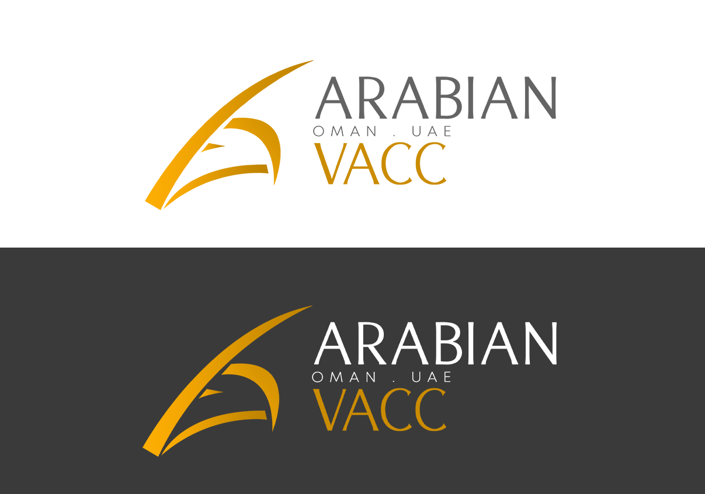
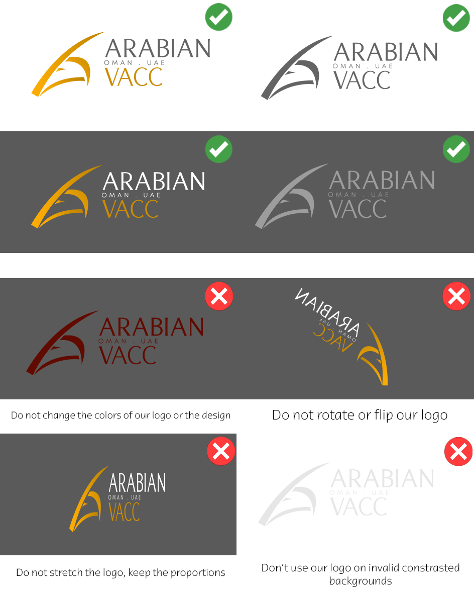

# Branding Guidelines
## Guideline Information
### Control Details
|                     |                            |
|:-------------------:|:--------------------------:|
|         Type        |           Guideline        |
|       Revision      |           03/2026          |
|    Effective Date   |         01 SEP 2026        |
|     Prepared by     | Ali Ismail - ACCARB5 & Ibrahim Dave - ACCARB51  |
|     Approved by     | Ali Ismail - ACCARB5 |
|   Next review date  |         30 JUL 2027        |
| Cancelled documents |             NIL            |

### Record of Revisions
| Revision Number | Notes        | Effective Date |
|-----------------|--------------|----------------|
| 01/2025         | Initial Issue| 18 AUG 2025    |
| 03/2025         | Updated the links within the policy | 01 SEP 2026    |

## Scope
Welcome to the **Arabian vACC Branding Guidelines**. This document serves as a comprehensive guide for anyone creating, applying, or simply interested in our branding. Whether you are designing event banners, preparing announcements, or developing new marketing content, these guidelines outline the standards, practices, and expectations that ensure our brand remains consistent and professional.  

Our branding represents not only the Arabian vACC, but also the wider VATMENA Division and its reputation within the VATSIM community. Through unified design standards, clear visual identity, and consistent application, we aim to deliver a professional image that strengthens recognition and trust across all of our events, services, and communications.  

This policy provides practical direction on **fonts, colors, logos, banners, announcements, and event materials** — including both what to do and what to avoid. By following these standards, we ensure that every piece of content we release contributes to a strong and cohesive identity for the Arabian vACC.  

!!! warning  
    All branding material and documentation contained in this section is intended solely for use by the Arabian vACC. Unauthorized use, duplication, or modification outside of the vACC is strictly prohibited.  

## Downloads
### Logo Media Pack
All approved variants of the **Arabian vACC logo** are included in our **Public Media Package**, which can be downloaded at the link below:  

🔗 [Download Public Media Package](https://drive.google.com/file/d/1baV1OPtnPmmGAq1e32piGmPk4V3Qyxvk/view?usp=sharing)  

This package ensures that everyone uses the correct, high-quality logo files in accordance with our branding guidelines.

### Font
The Arabian vACC uses the **Mulish** font for all official branding and communications.  

🔗 [View Mulish on Google Fonts](https://fonts.google.com/specimen/Mulish)  

!!! info
    1. Open the link above.
    2. Click **"Download Family"** in the top-right corner to download the font files to your device.

### Banners
For detailed guidelines on banner creation, usage, and specifications, please refer to our separate **Banner Policy**:  

🔗 [View Event Banner Policy](https://library.vatsim-arabian.com/policies/marketing/banners/)
🔗 [View Examination Banner Policy](https://library.vatsim-arabian.com/policies/marketing/examinations/)

## The thoughts behind the logo
The logo was designed by **Naman Gaur (1506377)** following the merger of the **Bahrain & Qatar, Emirates, and Muscat vACCs**. It features a modern, clean, and professional design, emphasizing clarity and precision. The design incorporates an oryx, symbolizing the unity of the three countries, and is minimalistic, reinforcing simplicity and elegance. This was then updated in June 2026 by **Ibrahim Dave (1699621)** following the removal of the OTDF FIR from the Arabian vACC leaving OMAE and OOMM.

The white color suggests neutrality, simplicity, and versatility, providing high contrast on darker backgrounds and making the logo adaptable for various digital and print applications. Chrome yellow represents the desert, optimism, and energy, aligning with the vACC’s hashtags: #clearmission & #clearvision

<figure markdown>

</figure>

### Color Palette
<figure markdown>

</figure>

### Logo Guidelines
The logo may be used in either its **positive** or **negative** variant, depending on the background. There are also **all-black** and **all-white** variants available, intended for **special cases only**.

<figure markdown>

</figure>
